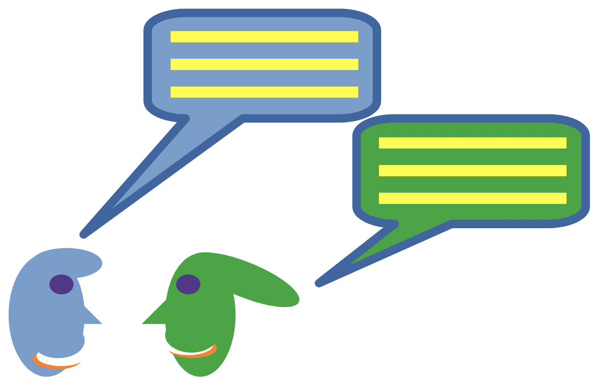

# CS101 Data Structures

Activity 08: Socket Programming with Classes and Exceptions - Chat & Game App

## Assigned and Due

- **Assigned**: Wednesday, 18 March 2026 at start of class
- **Due and Expiration**: Monday, 23 March 2026 at start of class

Note: the expiration date is the last date you can submit your work for a grade.

<center>



</center>

## Table of Contents
- [CS101 Data Structures](#cs101-data-structures)
  - [Assigned and Due](#assigned-and-due)
  - [Table of Contents](#table-of-contents)
  - [Overview](#overview)
  - [Learning Objectives](#learning-objectives)
  - [Project Goals](#project-goals)
  - [Instructions](#instructions)
  - [Deliverable](#deliverable)
  - [Submission](#submission)
  - [GatorGrade](#gatorgrade)
  - [Seeking Assistance](#seeking-assistance)

## Overview

In this activity you will build a **real-time direct messaging application** using Python socket programming, classes, and exception handling. You'll create a server that can handle multiple client connections, implement a colorful client interface, and then play games (like Rock, Paper, Scissors) with your classmates!

The tutorials progress through a complete client-server application:

1. **Build a Message Server**: Create a multi-threaded server using classes and exceptions
2. **Build a Message Client**: Create a colorful client with proper error handling
3. **Communicate & Play**: Use your app to chat and play Rock, Paper, Scissors with friends!

By the end, you'll have a working messaging app that you can use to communicate with classmates in real-time.


## Learning Objectives

By completing this activity, you will be able to:

1. **Implement socket programming** using Python's `socket` library for network communication
2. **Design classes** that encapsulate server and client behavior
3. **Handle exceptions** gracefully to manage network errors and connection issues
4. **Use multi-threading** to handle concurrent client connections
5. **Add color to terminal output** to make applications more engaging
6. **Build interactive applications** that combine messaging and game logic


## Project Goals

- Complete all three tutorials by copying and running the provided code
- Understand how client-server architecture works
- Test your messaging app with at least one classmate
- Play Rock, Paper, Scissors using your custom application
- Reflect on network programming concepts and exception handling

## Instructions

Work through the tutorials in order:

1. This class,
   - **Tutorial 1** (`tutorials/tutorial_01/tutorial_01.md`): Create the message server with threading and exception handling
2. This class,
   - **Tutorial 2** (`tutorials/tutorial_02/tutorial_02.md`): Build the client with colored output and user-friendly interface
3. Next class
   - **Tutorial 3** (`tutorials/tutorial_03/tutorial_03.md`): Connect, communicate, experiment aand play games!

Each tutorial provides:

- Complete, copy-paste ready code
- Step-by-step explanations of what each section does
- Instructions for running and testing your code
- Tips for troubleshooting common issues

**Time Estimate**:

- Building (Tutorials 1-2): This class
- Testing & Playing (Tutorial 3): Next class

## Deliverable

This is a check mark grade.

After completing all tutorials, submit:

1. All source files in `tutorials/tutorial_01/src/`, `tutorial_02/src/`, and `tutorial_03/src/`
2. Completed reflection document in `writing/reflection.md`

Make sure you:

- Test your server and client on your local machine
- Connect with at least one classmate and exchange messages
- Play at least one game of Rock, Paper, Scissors
- Answer all reflection questions


## Submission

Submit your work via GitHub Classroom. Make sure all files are committed and pushed:

```bash
git add .
git commit -m "Complete Activity 08: Socket Programming Chat App"
git push
```

## GatorGrade

You can check your progress using GatorGrade:

```bash
gatorgrade --config config/gatorgrade.yml
```

This will verify that you have:

- Created all required source files
- Completed the reflection document
- Included required code elements (classes, exceptions, functions)

## Seeking Assistance

If you encounter issues:

1. **Connection Problems**: Make sure your server is running before starting the client
2. **Port Issues**: If port 5555 is in use, try 5556 or another port number
3. **Firewall**: Check that your firewall allows local connections
4. **Classmates**: Try connecting with a classmate - share your IP address for remote connections

For additional help:

- Review Python socket documentation at https://docs.python.org/3/library/socket.html

**Have fun building and playing with your messaging app!**
